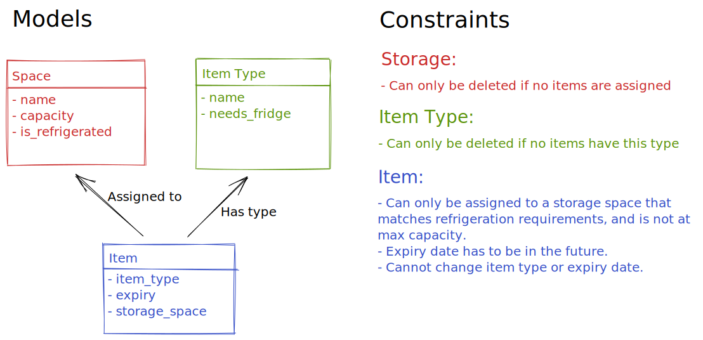

# Notes

## Other Documents

- [Endpoints](documents/Endpoints.md)

## How to run?

You can run this service either with Docker or a local python 3.8+ installation.

### Using Docker

With Docker (and docker-compose) installed and running, you can run either of the following commands:

#### Via docker-compose

```bash
# create container
docker-compose up --build -d
# Create database tables. Only needed to run on new container
docker-compose exec store-backend python manage.py create_db
```

#### Via makefile (shortcut for docker-compose)

```bash
# create container
make up
# Create database tables. Only needed to run on new container
make create_db
```

You can then visit `http://localhost:8000/health_check` to check that the service is running successfully.  
You can also run `make seed_db` to add some dummy data to the database.

### Using Python

Tested on python3.8 and 3.10.

#### Install requirements

```bash
# optionally, consider using a virtual environment
pip install -r requirements.txt
```

#### Create Database Tables

```bash
python manage.py create_db
```

#### Start server

```bash
sanic src.server:create_app --factory --dev
```

Visit `http://localhost:8000/health_check`

## Design

### Models



### Architecure

I picked an MVC architecure with a separate view/controller/model for each entity.  
Views are stored in `src/views/...`  
Controllers are stored in `src/controllers/...`  
Models are stored in `src/models.py` 

### Framework

### Testing

### What's Missing
