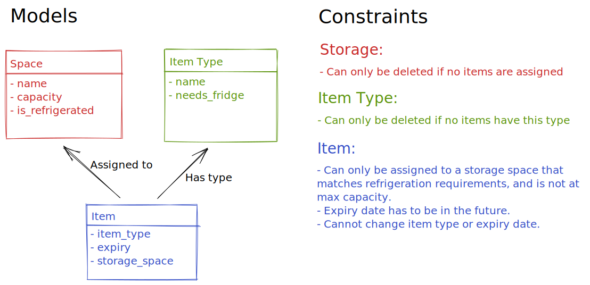

# Notes

## Other Documents

- [Endpoints](documents/Endpoints.md)

## How to run?

You can run this service either with Docker or a local python 3.8+ installation.

### Using Docker

With Docker (and docker-compose) installed and running, you can run either of the following commands:

#### Via docker-compose

```bash
# create container
docker-compose up --build -d
# Create database tables. Only needed to run on new container
docker-compose exec store-backend python manage.py create_db
```

#### Via makefile (shortcut for docker-compose)

```bash
# create container
make up
# Create database tables. Only needed to run on new container
make create_db
```

You can then visit `http://localhost:8000/health_check` to check that the service is running successfully.  
You can also run `make seed_db` to add some dummy data to the database.

### Using Python

Tested on python3.8 and 3.10.

#### Install requirements

```bash
# optionally, consider using a virtual environment
pip install -r requirements.txt
```

#### Create Database Tables

```bash
python manage.py create_db
```

#### Start server

```bash
sanic src.server:create_app --factory --dev
```

Visit `http://localhost:8000/health_check`

## Design

### Models



### Architecure

I picked an MVC architecure with a separate view/controller/model for each entity.  
Views are stored in `src/views/...`  
Controllers are stored in `src/controllers/...`  
Models are stored in `src/models.py`

### Framework

I picked the Sanic Framework for Python as recommended. This was my first time working with an async backend framework for python as well.  
While I did eventually got everything to run as I want, I felt that Sanic is missing a lot of the features and in-depth documentation of frameworks like Flask and Django.  
Missing: DB Connection (Like Flask-SQLAlchemy or Django Models).  
Insufficient Documentation: Using an App factory, Request Validators, Response Serializers, Endpoint documentation.

### Helpers

I added a `manage.py` file to help with creating the database tables after starting the server, as well as populating the tables with dummy data.  
I used a `Makefile` to store my commonly used commands. Eg. Starting/Stopping the dev server, following logs, running tests, linting/formatting, and re-creating/seeding the database tables.

### Testing

I tried my best to cover all use cases described in the original README document for this assignment.  
I have mainly relied on integration tests for this assignment, as they allow me to cover a lot of use cases with less code.  
Every test creates a new sanic app, an SQLite in-memory database, and SQL tables.

### What's Missing

Given more time, I would have liked to add the following:

- Pydoc for the important functions.
- OpenAPI documentation for each endpoint.
- Logging.
- Unit Tests.
- A production Dockerfile.
- The ability to create an item using the storage name or item type instead of just id.
